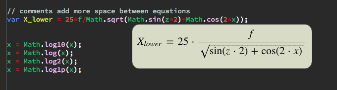

mathDisplay is a brackets extension that displays javascript math in an easy to understand way using MathJax.   

To use, just hit CMD-ALT-M while the cursor is on line line you want.     
For multiple lines, hightlight the equations you want, and hit CMD-ALT-M.

The following preferences are allowed:

Don't show is an array of sequences you want to hide from visualization. (useful for namespaces. and objects.)       
Make sure you escape special RegEx chars
 
    "mathViz.dontShow": [
        "Math\\."
    ],

Replace is an object{ replacement : toBeReplaced }       
Make sure you escape toBeReplaced values.

    "mathViz.replace": {
        "arcsin": "Math\\.asin",
        "arccos": "Math\\.acos",
        "arctan": "Math\\.atan"
    },
    

Don't escape is an array of objects you want to prevent from being escape    
-if you want MathJax to display a word as its symbol (alpha=>α), you need to add it to this array.   
-A full list of escaped sequences is in the defs.json file (let me know if you find some it's missing)
(arccos is here because cc is a special sequence, and if the cc in arccos is escaped, it wont appear as expected)

    "mathViz.dontEscape": ["arccos", "theta"]
  

Style allows you to control css settings.    
-mathDiv is the box the math is displayed in.      
-All values listed are default values. The style is updated whenever you save your Preferences file.   
-rightOffset only applies when using multiple lines
    
    "mathViz.style": {
        "mathDivCSS": {
                'position'      : 'absolute',
                'display'       : 'none',
                'margin-top'    :'1.5em',
                'padding'       : '10px',
                'padding-right' : '15px',
                'z-index'       :'150',
                'background'    : '#d8dcc6',
                'border'        :  '1px solid #595959',
                'border-radius' : '15px',
                'color'         : 'black',
                'font-size'     : '1.5em'
        },
        "equationsCSS": {
           
        },
        "commentsCSS": {
                'margin-top': '50px',
                'font-size': '.8em',
                'color': '#353535'
        },
        "rightOffset": 35
        
    }
    
    
    
Please raise an issue if something isn't being displayed as expected, and let me know if there are other languages you want supported besides javascript or if there are other features that would make this extension more useful.
    
